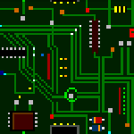

## ```Hello, World!```

<!-- BROKEN -->

### I'm Adam Bonner

- 💾 Version Control Enthusiast
- 📡 Loves to talk about Networks, Road Warrior VPNs, and VLANs
- 🐍 Hobbyist Python Developer, I've dabbled with HTML+CSS, NSIS, PowerShell, Groovy, Gherkin, HLA, C, XSLT and MATLAB
- 👔 Decisioning Engineering Director at [Experian](https://www.experian.co.uk/business/customer-journey/acquisition)
- 👷🏼 Free time spent with LEGO Mindstorms, Raspberry Pi and Power Tools (running network cables!)
- 🎓 MSc Comp Sci Graduate (with Distinction)
- 👨‍💼 Find me on [LinkedIn](https://www.linkedin.com/in/adambonneruk/)

## Interesting Configurations
I like to use Git for more than _just_ code. Below is a small collection of public configurations I share for those who might want inspiration. All of which are MIT Licenced; feel free to use and adapt for your own purposes!
| Preview | Description |
| ------- | ----------- |
|  | [Config-Network](https://github.com/adambonneruk/config-network): This project is used to store my active docker-compose configuration running on a Raspberry Pi 4 (utilising a PoE hat) whilst also serving as a future reference and guide for anyone wanting to do something similar. This Project combines [Unifi](https://github.com/jacobalberty/unifi-docker), [PiHole](https://hub.docker.com/u/pihole/) and [OpenSpeedTest](https://hub.docker.com/u/openspeedtest#!).
|  | [Config-PowerShell](https://github.com/adambonneruk/config-powershell): My Windows PowerShell configuration, including posh-git and useful functions/aliases, I spend a lot of time in the Windows Terminal so having this configuration (publicly) available for different machines is useful. |
|No Icon|[Config-AV](https://github.com/adambonneruk/config-av/): Useful links, guides and reference content for my surround-sound home AV setup|

## My FOSS Software Projects
Written mainly in Python and compiled with PyInstaller, my FOSS projects are licenced under the standard MIT Licence. Which in the words of Simon Tatham: _"This means that you can do pretty much anything you like with the binaries or the code, except pretending you wrote them yourself, or suing me if anything goes wrong."_

| Icon | Name | Tech Demo | Description |
| ---- | ---- | --------- | ----------- |
|  | [Space Cadet Pinball Installer](https://github.com/adambonneruk/space-cadet-pinball) | NSIS | **Want to Play the Windows XP classic on modern Windows 10 x64?** "Space Cadet Pinball" uses NSIS to package the right files together and create a portable installer you can use to put XP's classic game on your modern desktop |
|  | [Watch](https://github.com/adambonneruk/watch) | Python | **Need to watch a directory, without refreshing?** "Watch" is a small python utility to watch a given directory, printing out all the contents and refreshing automatically, used in one or two demos to show Git DB changes. |
|  | [Unique](https://github.com/adambonneruk/uuid-generator) | Python / GUI / UUID |**Need some UUIDs?** "Unique": UUID generator tool. unique.py will generate UUIDs (using a CLI) in a variety of flavours whilst unique_gui.py wraps this up in a pretty GUI. This project in available as native python source, a windows executable and docker image. |
|  | [Awake](https://github.com/adambonneruk/awake) | Multi Threading Python | **Need to stop your Windows PC from locking/sleeping?** "Awake: Stay Awake, Don't Sleep!" is a small Python utility designed to keep a machine/workstation from going idle. Leveraging the awesome PyAutoGUI library to impersonate a human being and programmatically control the keyboard, this utility presses the scroll lock key ~2 times a second. |
|  | [Transpose](https://github.com/adambonneruk/transpose-dsv) | CSV / Python | **Need to switch (transpose) the Columns and Rows in a CSV file?** Transpose is a CLI-based transposing of delimiter-separated values (including .csv/comma-separated values). |
|  | [Nope](https://github.com/adambonneruk/nope) | Linux / Docker / Dive | **Need to give people a simple "Russian doll" view of Docker images?** Nope is a Dockerfile project designed to teach (and serve as my own reference for) building, running and hosting Dockerfile images on Github and Docker Hub). Leveraging the publicly-maintained httpd image and inserting some .html code. |
|  | [Phone-Num-Split](https://github.com/adambonneruk/phone-num-split) | Python / RegEx | **Need to split a UK Telephone Number into Area Code and Local Number?** phone-num-split lets you do that at the command line, using regex patterns and some cleaning logic to turn most valid (albiet non-standard format) numbers into the usual groupings |
