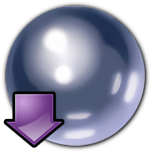

## ```Hello, World!```


### I'm Adam Bonner

- 👔 Decisioning Engineering Director at [Experian](https://www.experian.co.uk/business/customer-journey/acquisition), In work I use the following tech/software:
  - SOA, SOAP, WSDL and Soap UI
  - REST, Swagger, JsonSchema, and Postman
  - PowerCurve Originations, SMaaS, and Experian One
- 🎓 MSc Comp Sci Graduate (with Distinction)
- 👨‍💼 Find me on [LinkedIn](https://www.linkedin.com/in/adambonneruk/)
- 💾 Obviously a version control enthusiast!
- 📡 Loves to talk about networks, wi-fi and vlans
- 🐍 Always learning about new technology, hardware and software languages (currently Python and NSIS)
- 👷🏼 Free time spent with LEGO Mindstorms, Raspberry Pi and Power Tools

#### My Repositories
Here is a quick summary for some of the FOSS code i've written as personal projects. All licenced under MIT, which in the words of Simon Tatham ; _"means that you can do pretty much anything you like with the binaries or the code, except pretending you wrote them yourself, or suing me if anything goes wrong"_.

|                          Icon                           | Respository                                                                            | Description                                                                                                                                                                                    | Language       | Licence |
| :-----------------------------------------------------: | -------------------------------------------------------------------------------------- | ---------------------------------------------------------------------------------------------------------------------------------------------------------------------------------------------- | -------------- | :-----: |
|            | [PyRadials](https://github.com/adambonneruk/pyradials)                                     | Manage your Survey from _Field to Finish_: Traverse, Reduce, and Plot! Designed to convert Lecia TPS1100 .GSI into .DXF for AutoCAD. Supports Topographical and Building Surveys               | Python         |   MIT   |
|                | [Awake](https://github.com/adambonneruk/awake)                                         | A small utility sitting in the Windows system tray; preventing the system from entering sleep or turning off the display. Uses Windows system calls and the pystray module                     | Python         |   MIT   |
|            | [Cargoship](https://github.com/adambonneruk/cargoship)                                 | Hosting PiHole, a Unifi controller, OpenSpeedTest, Gitea, and an NTP Server with Debian Linux (on the metal) wrapped up with Nginx (Proxy Manager) for TLS. Backed up with Rclone + Cron       | Docker-Compose |   MIT   |
|               | [Unique](https://github.com/adambonneruk/unique)                                       | Written in Python, Unique is a UUID and ULID generator packaged as a command line executable (with colour) and a graphical/windowed notepad-like tool that works on Windows, Mac OS, and Linux | Python         |   MIT   |
|  | [Space Cadet Pinball (Installer)](https://github.com/adambonneruk/space-cadet-pinball) | Combining public domain files with k4zmu2a's decompilation to enable the classic pinball game on newer versions of Windows. Wrapping everything together in an easy-to-use portable installer  | NSIS           |   MIT   |
|                 | [NOPE](https://github.com/adambonneruk/nope)                                           | Demonstrating hosting a simple web page using httpd to show how the image and the .html file are containerised together (in the Dockerfile). Use Dive to show how this is assembled.           | Docker         |   MIT   |
